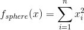

# YPEA: Yarpiz Evolutionary Algorithms
YPEA for MATLAB is a general-purpose toolbox to define and solve optimization problems using Evolutionary Algorithms (EAs) and Metaheuristics. To use this toolbox, you just need to define your optimization problem and then, give the problem to one of algorithms provided by YPEA, to get it solved.

## List of Provided Algorithms
Currently YPEA supports these algorithms to solve optimization problems. The list is sorted in alphabetic order.

1. Artificial Bee Colony (ABC)
2. Continuous Ant Colony Optimization (ACOR)
3. Bees Algorithm (BA)
4. Biogeography-based Optimization (BBO)
5. Covariance Matrix Adaptation Evolution Strategy (CMA-ES)
6. Differential Evolution (DE)
7. Firefly Algorithm (FA)
8. Genetic Algorithm (GA)
9. Harmony Search (HS)
10. Imperialist Competitive Algorithm (ICA)
11. Invasive Weed Optimization (IWO)
12. Particle Swarm Optimization (PSO)
13. Simulated Annealing (SA)
14. Teaching-Learning-based Optimization (TLBO)

## Installation
A MATLAB toolbox package file (*.mltbx) is available in the **dist** folder. You can right-click on this file inside MATLAB, and select the Install option to get it installed on your machine. This is the recommended way of installing YEPA.

However, if you prefer, the source code for YPEA is available in **src** folder, and you cand download it and add the **ypea** folder to the path of your MATLAB installation. 

The toolbox has its own documentation, which is accessible via MATLAB documentation center. You may find it under **Supplemental Software** section of MATLAB documentation center.

## How YPEA Works?
The main steps to setup your problem and solve it using YPEA are listed below:
1. Define Optimization Problem
   - Initialize an instance of optimization problem
   - Set the type of optimization problem (either minimization or maximization)
   - Define search space and decision variables
   - Define the objective function
     - Note: In case on constrained optimization problem, constraints are defined and using methods like penalty functions, they are incorporated into final objective function.
   
2. Use Optimization Algorithm
    - Create an instance of optimization algorithm class
    - Set the parameters of algorithms
    - Call `solve` method of the algorithm, passing the problem object into it
    - Get the optimization results and visualize (if needed to do so)

## A Classic Example
### Problem Definition
Assume that we would like to find 20 real numbers in the range [-10,10], which minimize the value of well-known sphere function, defined by:

<p align="center">
    
</p>

To define this problem, we run these commands in MATLAB:
```matlab
problem = ypea_problem();

problem.type = 'min';

problem.vars = ypea_var('x', 'real', 'size', 20, 'lower_bound', -10, 'upper_bound', 10);

sphere = ypea_test_function('sphere');

problem.obj_func = @(sol) sphere(sol.x);
```

### Particle Swarm Optimization (PSO)
Now, we are ready to use any of algorithms available in YPEA to solve the problem we just defind. Here we are going to use Particle Swarm Otimization (PSO). Let's create an instance of PSO (`ypea_pso`) and set its parameters.
```matlab
pso = ypea_pso();

pso.max_iter = 100;
pso.pop_size = 100;

pso.w = 0.5;
pso.wdamp = 1;
pso.c1 = 1;
pso.c2 = 2;
```

One may use so-called Constriction Coefficients for PSO, by running these commands:
```matlab
phi1 = 2.05;
phi2 = 2.05;
pso.use_constriction_coeffs(phi1, phi2);
```

Now, we are ready to get our problem solved. Let's call the `solve` method of PSO:
```matlab
pso_best_sol = pso.solve(problem);
```

The best solution found by PSO is accessible via:
```matlab
pso_best_sol.solution.x
```

### Differential Evolution (DE)
It is possible to pass the problem to other algorithm to get it solved. For example, if we sould like to use Differential Evolution (DE), we can create an instance of DE (`ypea_de`) and set its parameters. Assume that, we are using the `DE/best/2/bin`, which means:
- using best solution ever found as base vector,
- using two difference vectors for mutations (creating trial vector),
- and using binary method for crossover.

```matlab
de = ypea_de('DE/best/2/bin');

de.max_iter = 1000;
de.pop_size = 20;

de.beta_min = 0.1;
de.beta_max = 0.9;
de.crossover_prob = 0.1;
```

By calling `solve` method of DE and passing the problem into it, we can solve the optimization problem:
```matlab
de_best_sol = de.solve(problem);
```

The best solution found by Differential Evolution is given by:
```matlab
de_best_sol.solution.x
```

## Types of Decision Variables
One of dificulties in modeling and defining optimization problems is to deal with different kinds of decision variables. In YPEA, there several types of decision variables are supported and makes the problem definition much more easier.

Supported variable types in YPEA, are listed below:
- **Real Variables**, which are used to model real-valued (continuous) variables, in any size (scalar, vector, matrix, etc.), with any combination of lower and upper bounds.
  - Sample usage: most of real-world mathematical programming and optimization problems.
- **Integer Variables**, which are used to model integer-valued (discrete) variables, in any size (scalar, vector, matrix, etc.), with any combination of lower and upper bounds.
  - Sample usage: Generalized Knapsack Problem.
- **Binary Variables**, which are special case of integer variables, with lower bound set to 0, and upper bound set to 1;
  - Sample usage: Standard (Binary) Knapsack Problem.
- **Permutation Variables**, which are used to model permutations of some items, and can include more than one permutation per variable (as rows of a matrix).
  - Sample usage: Traveling Salesman Problem (TSP), n-Queens Problem, and Quadratic Assignment Problem (QAP).
- **Selection Variables**, which are used to model fixed-length selections of some items, and can include more than one selection per variable (as rows of amatrix).
  - Sample usage: Feature Selection.
- **Partition/Allocation Variables**, which are used to partition a list of items into dijoint subsets (also known as allocation and assignment), and can include more than one partitioning per variable (as rows of matrices).
  - Sample usage: Vehicle Routing Problem (VRP) and Hub Location Allocation.
- **Fixed Sum Variable**, which are used to model real-valued variables which are needed to have some fixed target sum value (in whole matrix, in rows, or in columns).
  - Smaple usage: Transportaion Problem.

All of these variable types, are encoded to real values in the range of [0,1]. Hence, all of algorithms implemented in YPEA, van be used to solve any defined problem, interchangeably.
