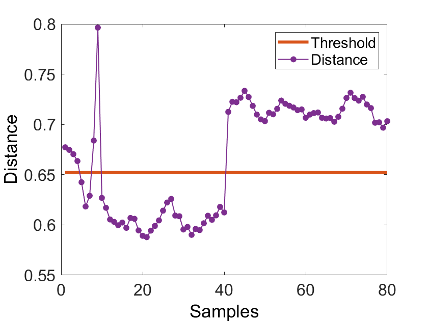

## Fault detection based on support vector data description (SVDD)

------------------------------------------------------------------------------------------------------------------
Updated on 28 May 2019	
1. Added descriptions for the calculation of the radius 
2. Added descriptions for the calculating the distance from the testing sample to the center of the sphere
------------------------------------------------------------------------------------------------------------------  

------------------------------------------------------------------------------------------------------------------
Updated on 24 May 2019	
1. Fixed some function descriptions 
2. Added support for some common kernel functions
------------------------------------------------------------------------------------------------------------------ 

## demo
```
% DESCRIPTION
% Fault detection based on Support Vector Data Description
%
%
% ---------------------------------------------------------------------%

clc
close all
addpath(genpath(pwd))

% Load  data (X: training data  Y: testing data)
load ('.\data\X.mat')
load ('.\data\Y.mat')

% Normalization (in general, this step is important for fault detection)
[X_s,Y_s] = normalize(X,Y);

% Set parameters 
C = 0.2;   % trade-off parameter
s = 6;     % kernel width
ker = struct('type','gauss','width',s);

% Train SVDD hypersphere
model = svdd_train(X_s,C,ker);

% Test a new sample Y (vector of matrix)
d = svdd_test(model,Y_s);

% Plot the results
plotResult(model.R,d)

```


  

